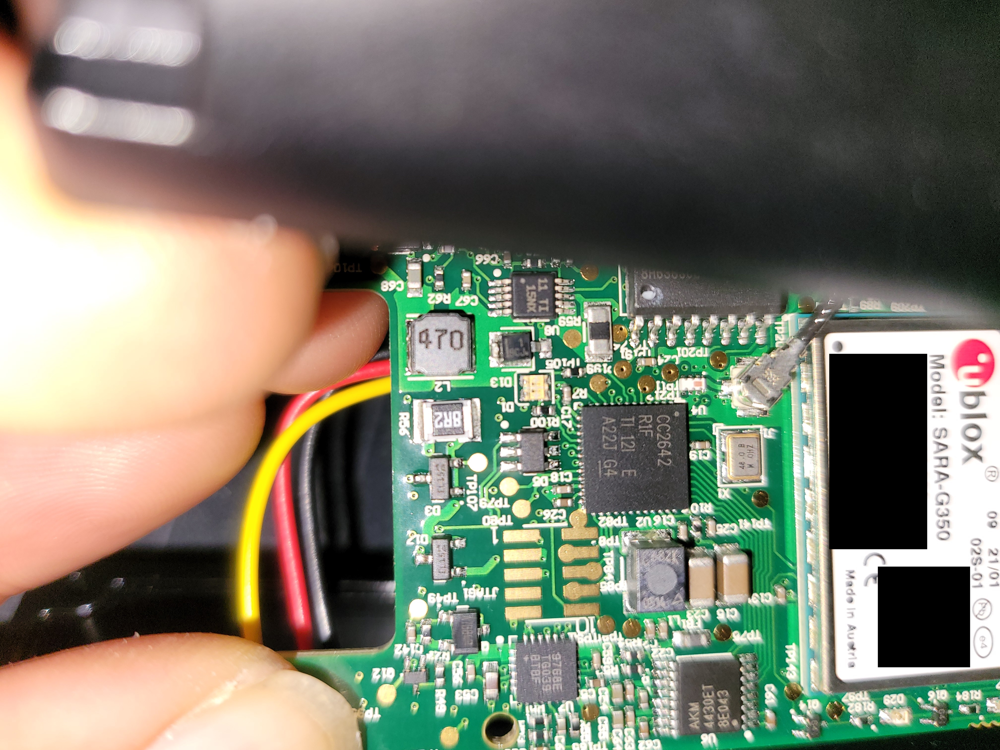
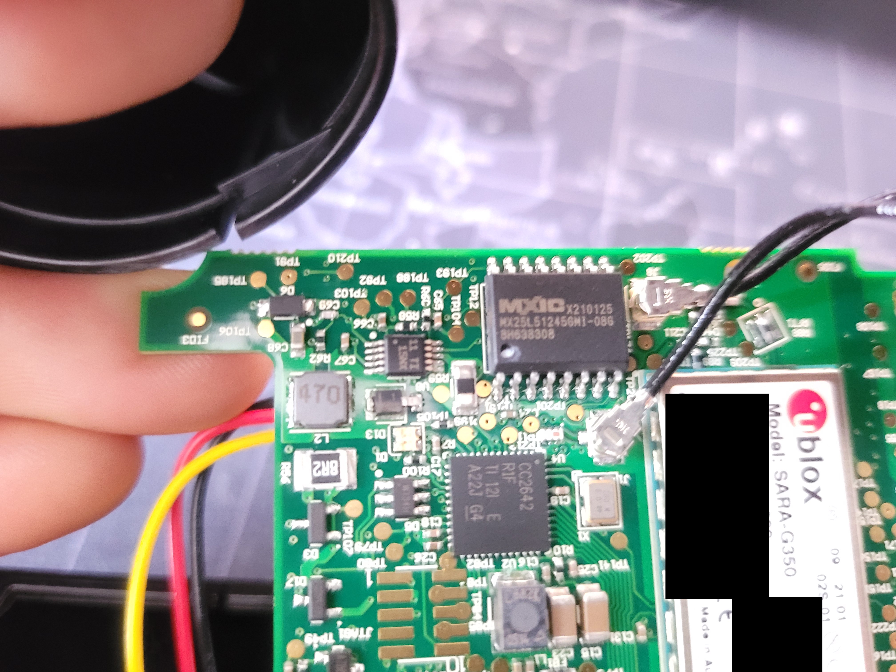
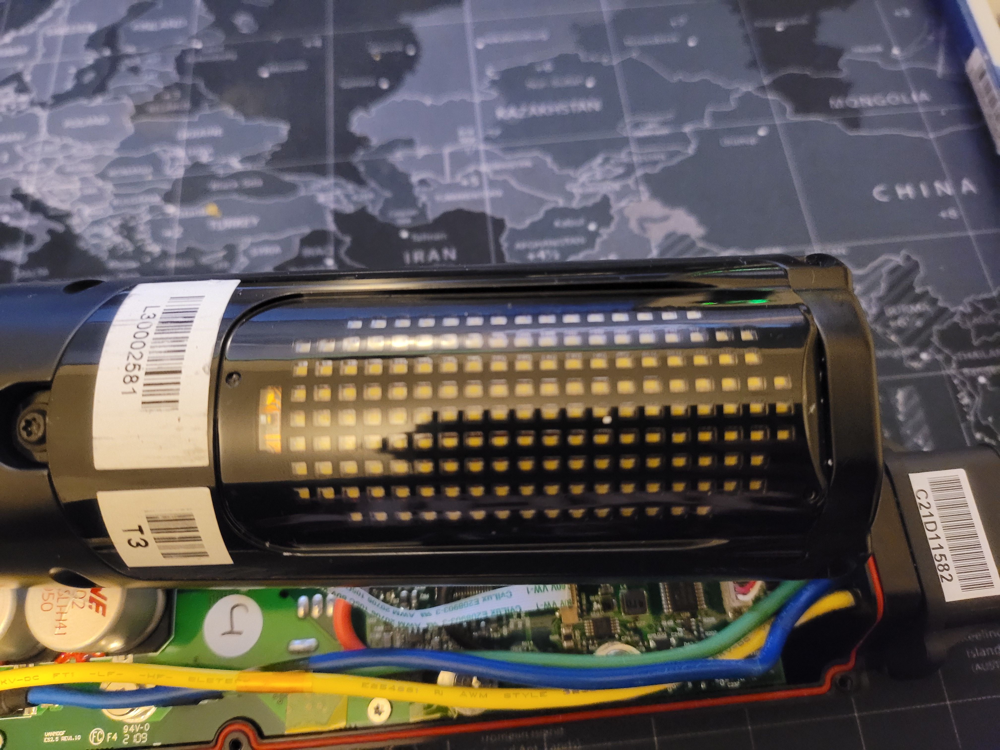
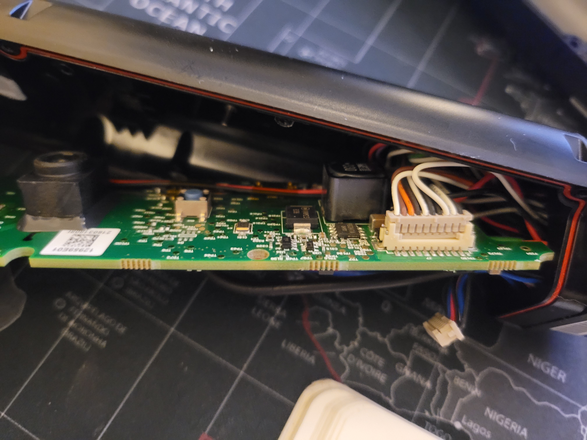
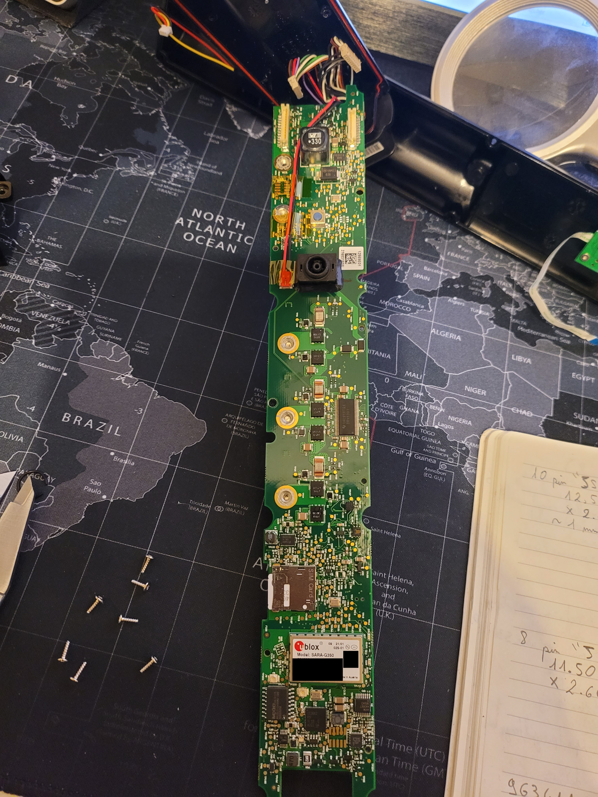
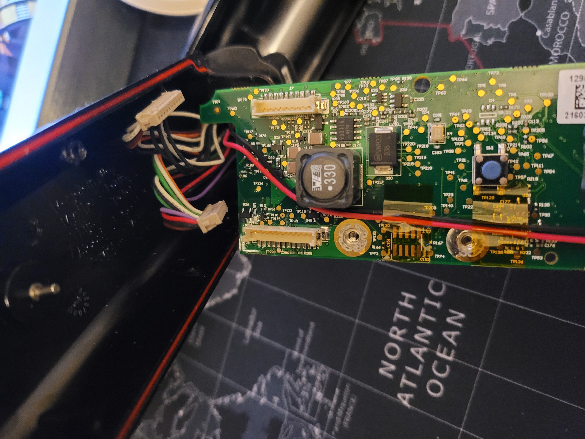
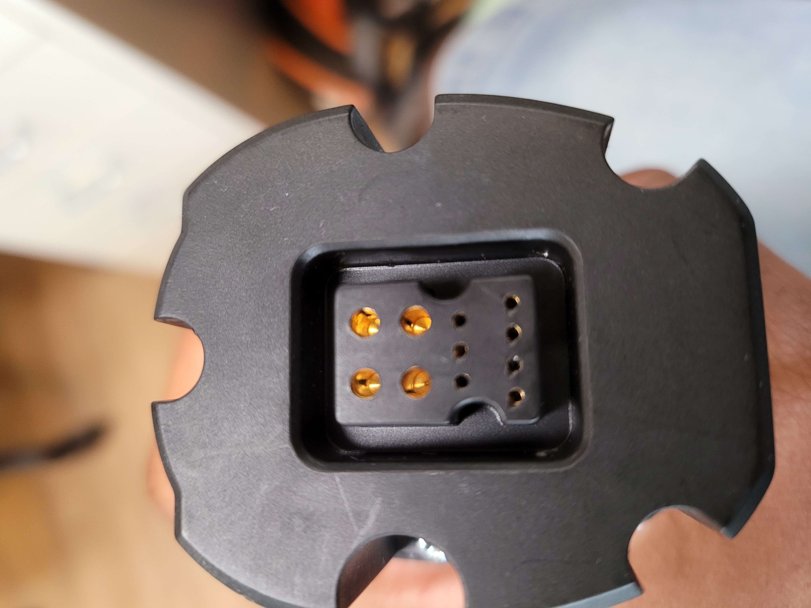
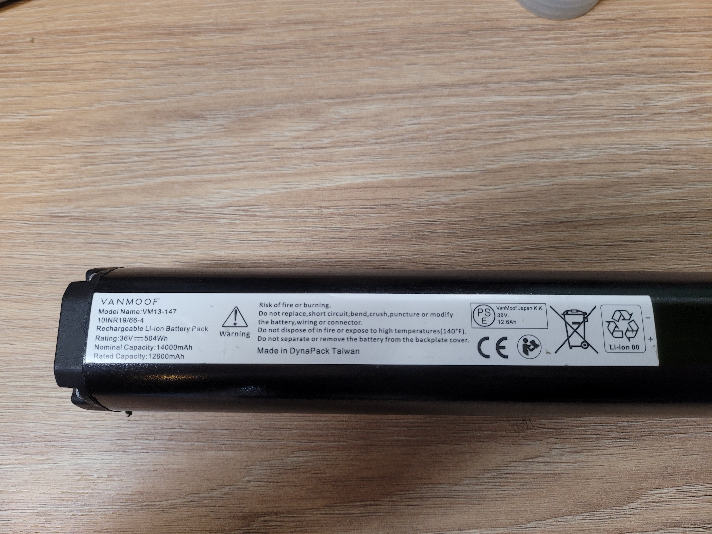
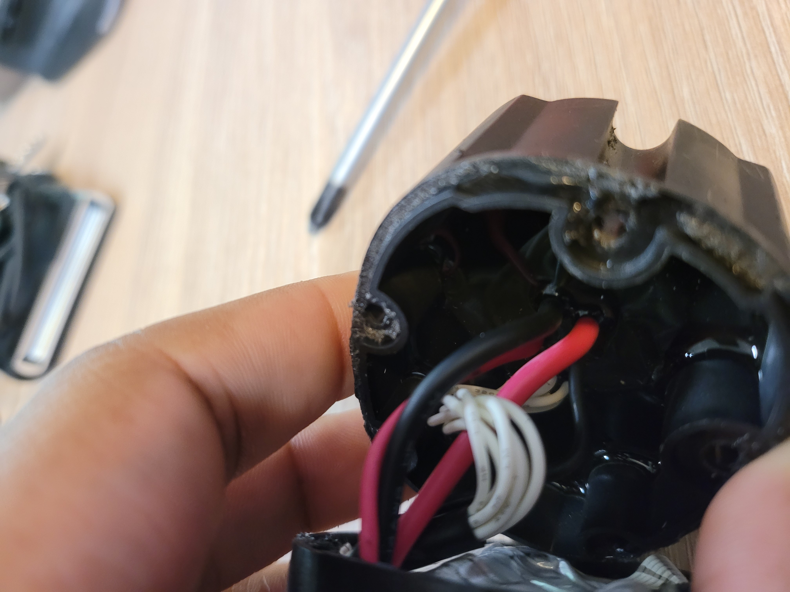
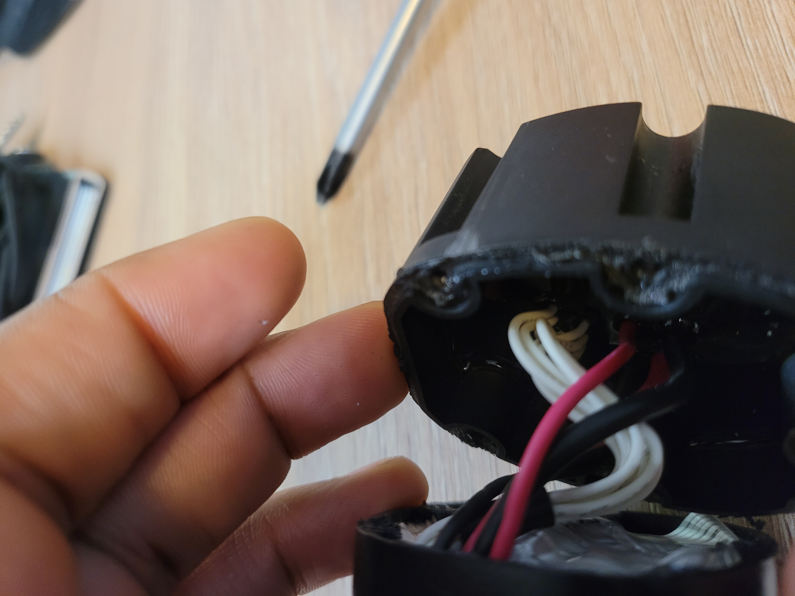

# SmartCartridge

## Component list

- 9G341AO523 -> BD9G341AEFJ Buck Converter Integrated FET
- YFO8E OAK -> TXB0108 8 channel Bi-directional logic level converter
- W145H
- 3014A709
- 81030204
- R31CU
- STM32F413VGT (debug interface near IC)
- WE 102-ASLI-H41 (Big capacitor)
- TMS320F28054 (footprint for JTAG on the other side of the board)
- XNST IL VO
- DRV8301 -> Three phase gate driver / [lib for simplefoc](https://community.simplefoc.com/t/drv8301-board-support/389)
- A8040L4703G
- OB1R
- BQ24133 -> 1 cell battery charger
- SARA-G350 -> GSM / GPRS module
- CC2642R1F -> Arm Cortex-M4F BLE wireless MCU
- AXM4430ET8E043
- 9768ETG039 -> speaker amp
- MX25L51245GHI -> 512 Mb SPI flash

## PCB Picture

# Spec

IMU ?

Boost mode 59 Nm

Range 60 km - 150 km

2 Mode : Max power and eco

Charging 36V 4A, 50% in 80 minutes, full charge in 4 hours

Wheel 24 inch

Weight 20.8 kg

Led light 40 Lux

4 automatic gear
# BMS
Top pcb have conformal coating :/

## Component list :

- STM32C072C (swd interface on pcb bottom)
- Battery cell NR18650MJ1 A062C032N1 (cant fully read it without desoldering battery cell)

(It's a pain to read chips name with the coating ...)
## PCB Picture

## Notes

- 11 pin connector (connected to each cells)
- 4P10S battery
- Connection to the bike : 4 power conductor (black and red cable) + 7 "data" / not power conductor (white cable)