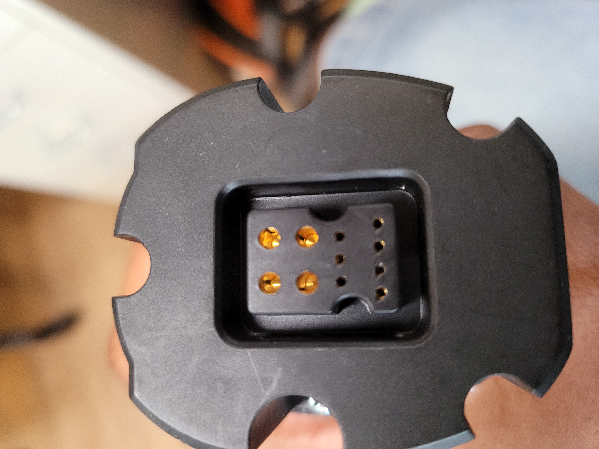
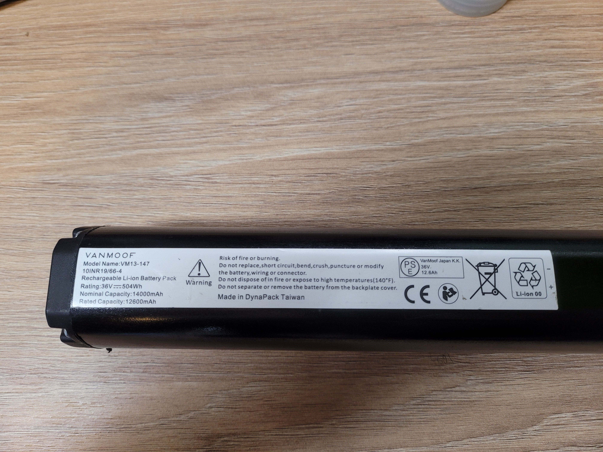
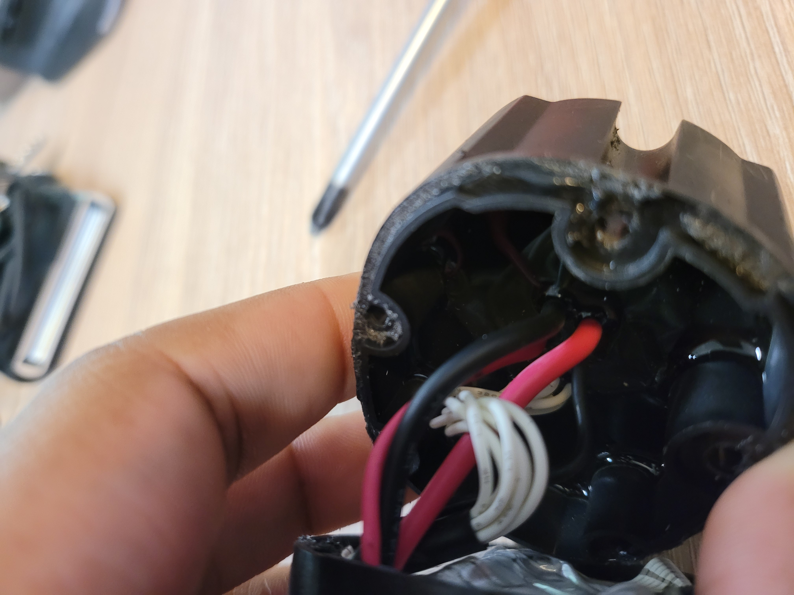
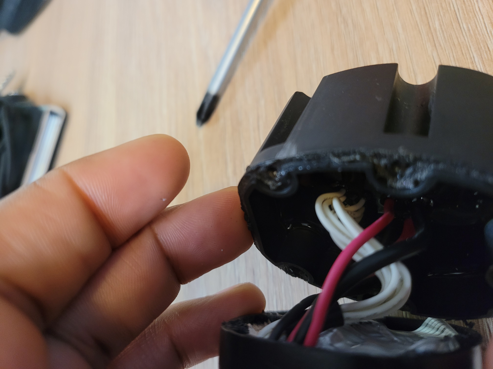

Top pcb have conformal coating :/

## Component list :

- STM32C072C (swd interface on pcb bottom)
- Battery cell NR18650MJ1 A062C032N1 (cant fully read it without desoldering battery cell)

(It's a pain to read chips name with the coating ...)
## PCB Picture

## Notes

- 11 pin connector (connected to each cells)
- 4P10S battery
- Connection to the bike : 4 power conductor (black and red cable) + 7 "data" / not power conductor (white cable)