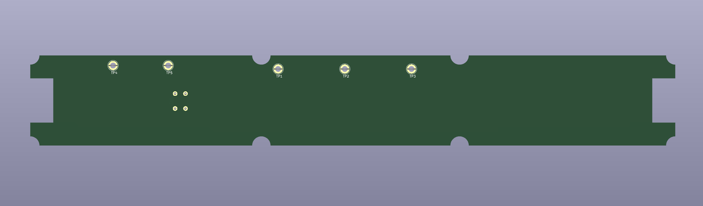
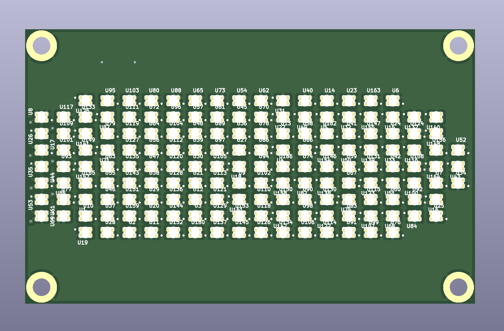

The led display is glued to the housing, charging port + original charger communication protocol will be hard to reverse, SIM slot + gsm antenna + backup battery are not needed so ... going for a 3D printed Smart Housing !

## 3D design of the smart cartridge housing

Still WIP
 
Online preview https://collaborate.shapr3d.com/v/ECH1UW3ffuTfgxgP5jvtE

All the cad is made on Shapr3d, if you need a file in a specific format create a github issue.

## BMS

Need to find compatible connector + cell specification

## SmartCartridge

Use the Pro-S3 from Unexpected Maker and I'm using [their kicad lib](https://github.com/UnexpectedMaker/esp32s3/tree/main)

Need to find compatible connector

Back 8 pin connector signals :

- GND
- Back light
- NC
- NC
- NC
- NC
- NC
- NC

Top front 10 pin connector signals :

- unknown
- unknown
- unknown
- GND
- unknown
- GND
- GND
- unknown
- unknown
- GND

Bottom front 12 pin connector signals :

- unknown
- GND
- unknown
- unknown
- unknown
- unknown
- GND
- unknown
- unknown
- unknown
- unknown
- unknown

Bottom front 10 pin connector signals :

- unknown
- GND
- unknown
- GND
- GND
- unknown
- unknown
- unknown
- GND
- unknown

## LedDisplay

166 WS2812-2020 RGB led (flexible pcb)
5V@6A peak 

