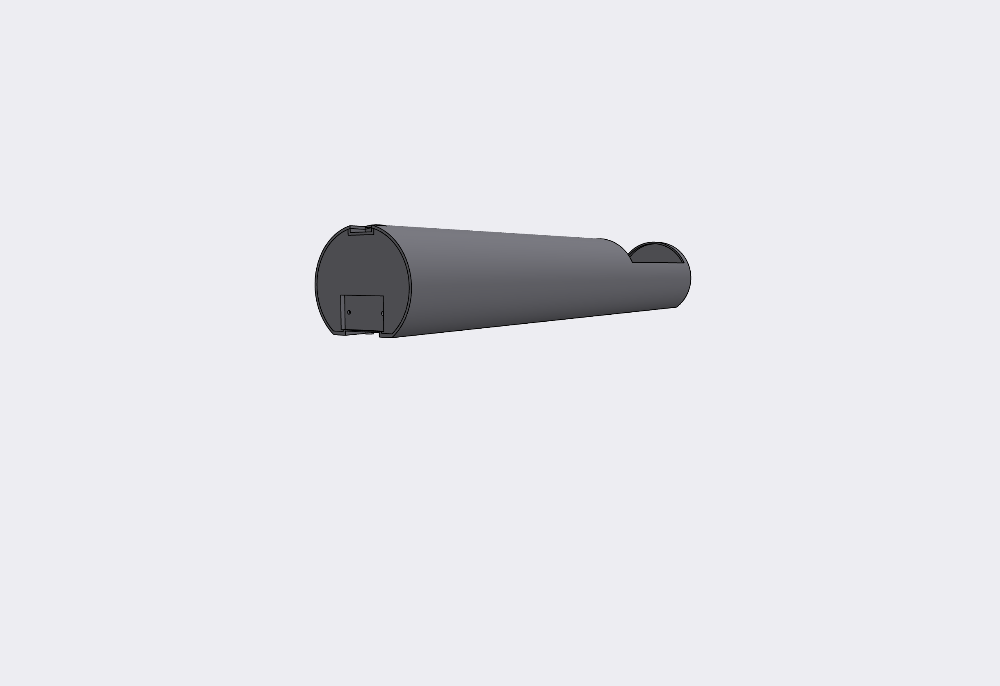
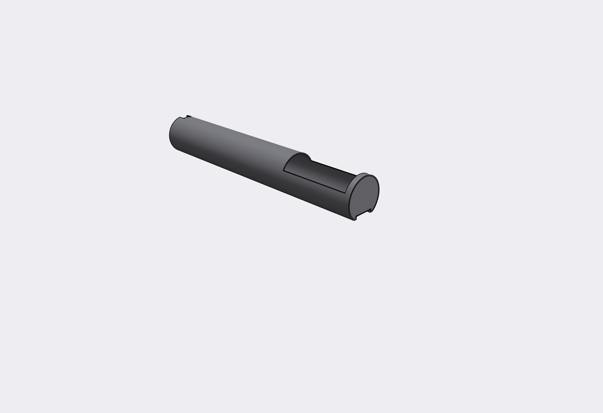
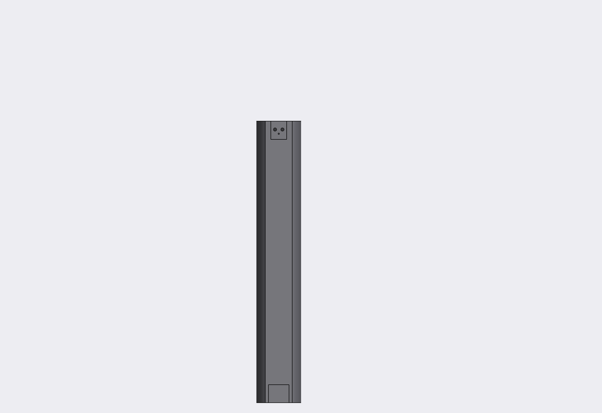

The led display is glued to the housing, charging port + original charger communication protocol will be hard to reverse, SIM slot + gsm antenna + backup battery are not needed so ... going for a 3D printed Smart Housing !

## 3D design of the smart cartridge housing

Still WIP
 
Online preview https://collaborate.shapr3d.com/v/ECH1UW3ffuTfgxgP5jvtE

All the cad is made on Shapr3d, if you need a file in a specific format create a github issue.

